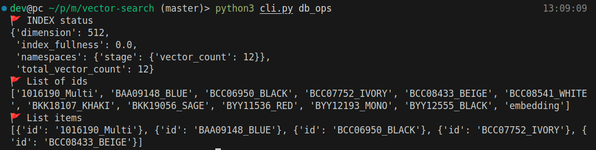
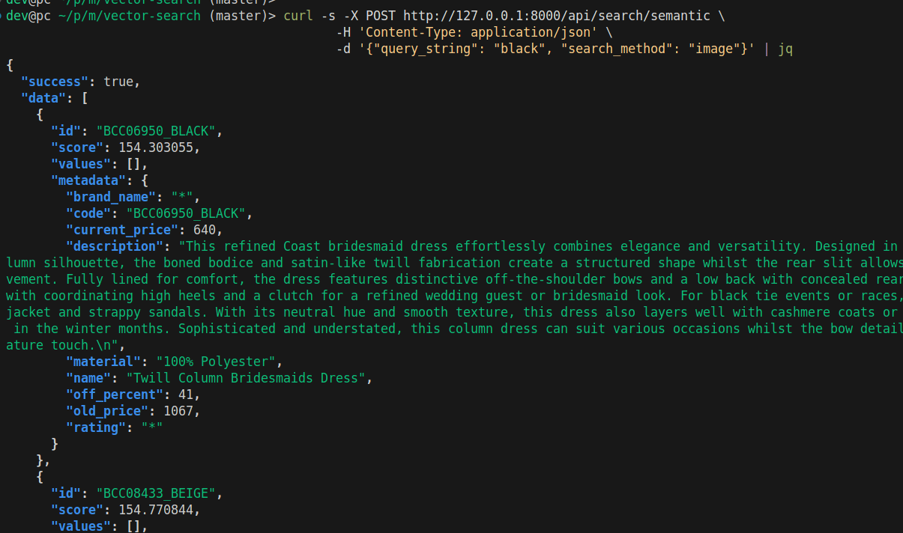

## Semantic product searching


### Install dependencies

```bash
pip install git+https://github.com/openai/CLIP.git
```

### Development

```bash
uvicorn main:app --reload
```

### Data jobs

#### A) Embedding images from folder `./images/`

```bash
python cli.py create_index \
   --namespace=product-search
```

#### B) Create job

```bash
python3 cli.py job_crawling
```

#### D) Check database status

```bash
python3 cli.py db_ops
```



### Testing

```bash
curl -X POST http://127.0.0.1:8000/api/search/semantic \
   -H 'Content-Type: application/json' \
   -d '{"query_string": "black", "search_method": "image"}'
```

